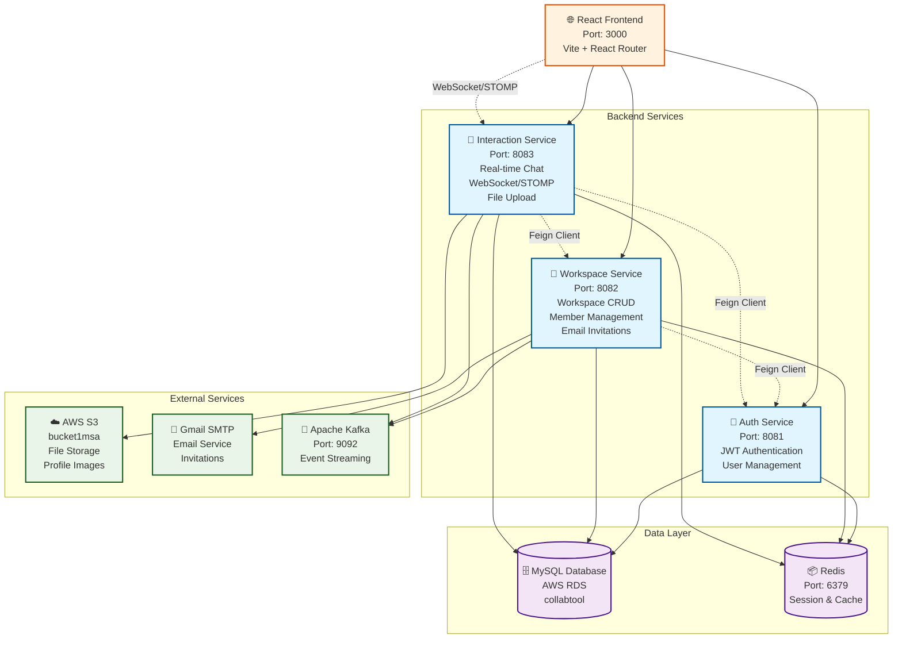
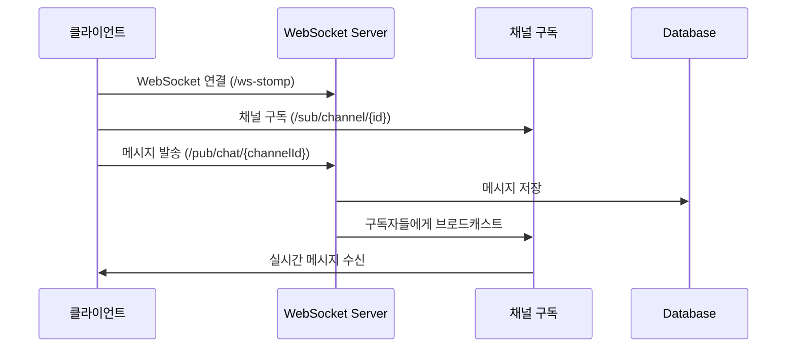

# Portal: 팀 협업 플랫폼

Portal은 실시간 채팅, 워크스페이스 관리, 초대 시스템을 제공하는 마이크로서비스 기반 팀 협업 플랫폼입니다.

## 🏗️ 시스템 아키텍처



## 📡 실시간 통신 아키텍처



## 🛠️ 기술 스택

### Frontend
- **Framework**: React 19.1.0 + Vite 7.0.4
- **Routing**: React Router DOM 7.7.1
- **Real-time**: WebSocket (@stomp/stompjs, sockjs-client)
- **Styling**: Custom theme system

### Backend
- **Framework**: Spring Boot 3.x
- **Language**: Java 17+
- **Architecture**: Microservices
- **Communication**: 
  - REST API
  - WebSocket/STOMP (Real-time)
  - Feign Client (Inter-service)
  - Apache Kafka (Event-driven)

### Database & Storage
- **Primary DB**: MySQL (AWS RDS)
- **Cache**: Redis
- **File Storage**: AWS S3
- **Message Queue**: Apache Kafka

### External Services
- **Email**: Gmail SMTP
- **Cloud**: AWS (RDS, S3)

##  서비스 상세

###  Auth Service (Port: 8081)
**역할**: 사용자 인증 및 권한 관리
- JWT 기반 인증
- 사용자 CRUD 작업
- Redis를 통한 세션 관리

**주요 API**:
```
POST /auth/signup    # 회원가입
POST /auth/login     # 로그인
GET  /auth/profile   # 프로필 조회
```

###  Workspace Service (Port: 8082)
**역할**: 워크스페이스 및 멤버 관리
- 워크스페이스 생성/수정/조회
- 멤버 관리 및 초대 시스템
- 이메일 발송 (Gmail SMTP)
- Kafka를 통한 이벤트 발행

**주요 API**:
```
POST /api/workspaces          # 워크스페이스 생성
GET  /api/workspaces          # 내 워크스페이스 목록
GET  /api/workspaces/{slug}   # 워크스페이스 상세 조회
POST /api/invitations/accept  # 초대 수락
```

###  Interaction Service (Port: 8083)
**역할**: 채팅 및 실시간 상호작용
- 실시간 채팅 (WebSocket/STOMP)
- 채널 관리
- 사용자 상태 관리 (온라인/오프라인)
- 파일 업로드 (S3)

**주요 API**:
```
WebSocket: /ws-stomp                           # WebSocket 연결
GET /api/channels/{channelId}/messages         # 채팅 기록
@MessageMapping("/pub/chat/{channelId}")       # 메시지 발송
```

##  주요 기능

###  실시간 채팅
- WebSocket/STOMP 기반 실시간 메시징
- 채널별 메시지 구독
- 파일 및 이미지 업로드
- 사용자 온라인 상태 표시

###  워크스페이스 관리
- 워크스페이스 생성 및 관리
- 멤버 초대 시스템 (이메일)
- 역할 기반 권한 관리
- 채널 생성 및 관리

###  인증 시스템
- JWT 기반 인증
- 세션 관리 (Redis)
- 사용자 프로필 관리


## 프로젝트에 적용한 내용들 ..

- DDD 기반 워크스페이스 생성 기능 설계 및 구현

https://rose-quesadilla-dab.notion.site/DDD-215440d2302f8066bc05cb36fb286376?pvs=74

- Redis 사용해 사용자 실시간 상태를 구현해보기

https://rose-quesadilla-dab.notion.site/Redis-224440d2302f80799d38cdfd69f6b6cf

- Redis+WebSocket으로 실시간 사용자 상태 리팩토링하기 

https://rose-quesadilla-dab.notion.site/Redis-WebSocket-249440d2302f802f922ae2952c94bd95


- 워크스페이스 초대 메일 발송 with @TransactionalEventListener

https://rose-quesadilla-dab.notion.site/with-TransactionalEventListener-215440d2302f804798f4dcb1478ecc3d


- 다른 디비 어케조회함? FeignClient를 사용해보자

https://rose-quesadilla-dab.notion.site/FeignClient-216440d2302f80d28325e79e12c010ed?pvs=74

- [MSA] Saga 패턴을 이용한 분산 트랜잭션 및 재시도 메커니즘 구현

https://rose-quesadilla-dab.notion.site/MSA-Saga-245440d2302f80b3a500f636b70e0537?pvs=73


